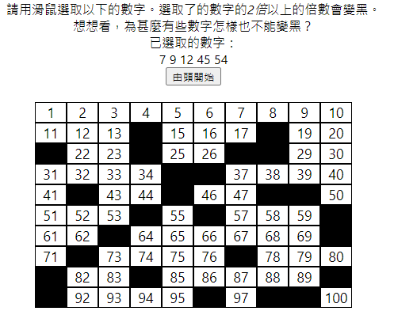
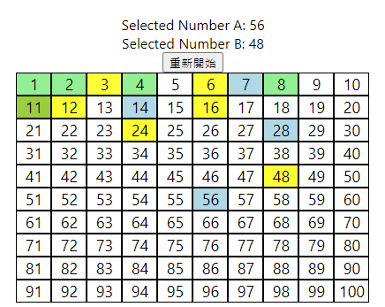
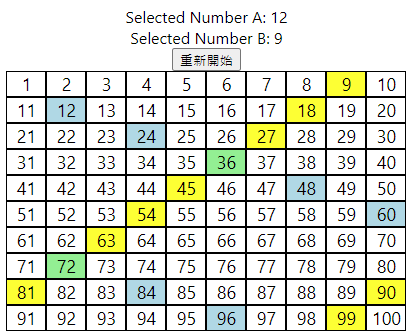

# Maths Visualised

Project URL: https://michaelcychan.github.io/maths-visualised/  

This projects is created for kids learning topics of prime numbers, factors, multiples (and maybe even more in the future). Clicking on the number grid will automatically show factors and multiples, hopefully this visualisation can help understanding.

## Usage and Screenshots

### Basic

There are three pages in the webpage, ie. 質數 (Prime number), 因數, (Factors), and 倍數 (Multiples). In each page, there is an simple explanation of the topic concerned and a number grid the users can play with. Users can also select the size of the number grid from 100 to 1000 with a pulldown menu.

### Prime Number

In the Prime number page, users can select a list of number by clicking on the number grid. All multiples of the selected numbers (except 1) will be blackened. The numbers that cannot be blacked are actually prime numbers, because they are not multiples of any number other than 1 and itself.  

### Factors

In the Factors page, users can select one or two numbers. The factors of the numbers will be coloured in blue or yellow. If a number is a common factor of both numbers, it is coloured green.  

### Multiples

In the Multiples page, users can select one or two numbers. The multiples of the numbers will be coloured in blue or yellow. If a number is a common multiple of both numbers, it is coloured green.  

## Tech used

The project uses React framework and TypeScript. It is hosted on Github Page using the [gh-pages](https://github.com/tschaub/gh-pages)  
